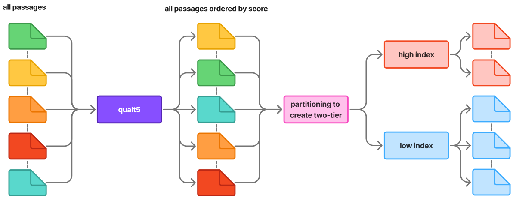
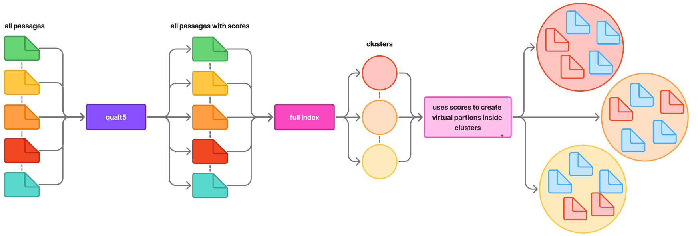
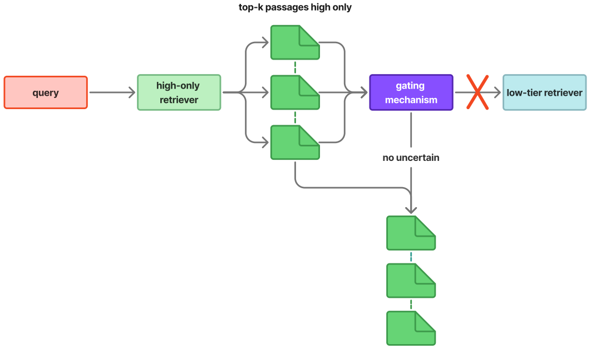
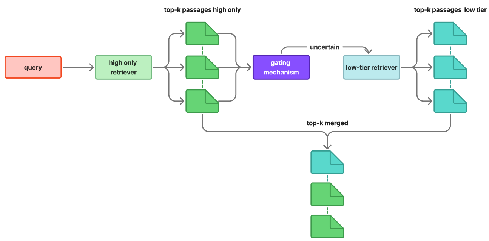
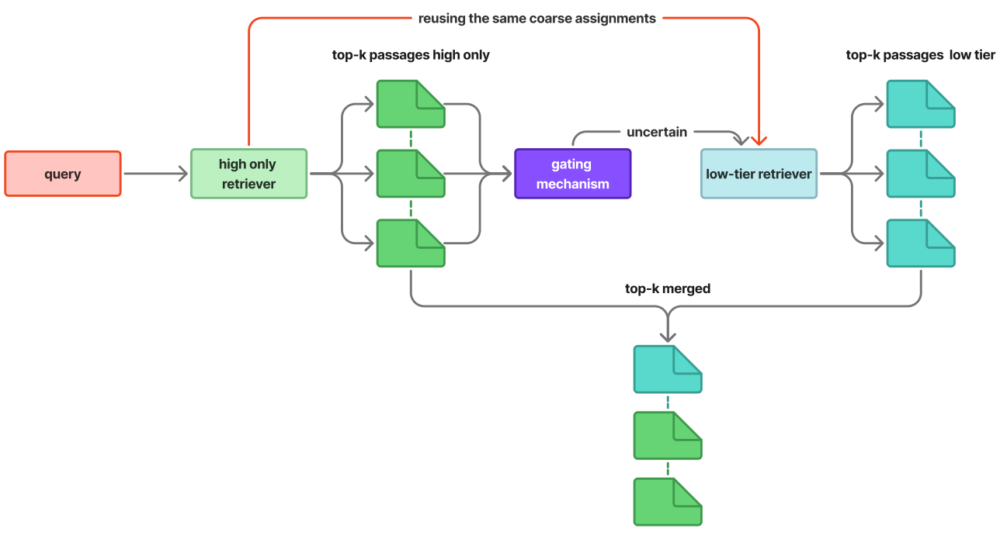

# TwoTierArchitecture

This repository contains scripts to build **FAISS IVF** indexes for dense retrieval (TAS-B embeddings), run **single-index** and **Two-Tier** retrieval experiments, and analyze results—especially around **QualT5** quality scores and **Virtual Partitioning** (dynamic High/Low partitions inside one IVF index).

A key convention is the `runs/` folder: most scripts write **timestamped** outputs there (logs, CSVs, plots), so experiments remain reproducible and easy to compare.

---

## Project goal (high level)

1. **Indexing**
   - Build IVF-Flat or IVF-PQ indexes (either a single *complete* index or a physical High/Low split).

2. **Evaluation**
   - Evaluate:
     - a **complete (single-tier)** index
     - a **physical Two-Tier** (High + optional Low via gating)
     - a **Virtual Partitioning** variant (single index + High/Low masks per IVF cluster)

3. **Analysis**
   - Compare QualT5 distributions (Tiny vs Base).
   - Study cluster-level quality thresholds for IVF.
   - Plot trade-offs (quality vs latency) from grid searches.
   - Summarize results from run outputs.

---
## Method overview (what this repository implements)

Dense first-stage retrieval can be viewed as a nearest-neighbor search problem in a shared embedding space: each query is encoded into a vector and the system returns the top-*k* passages whose vectors are most similar. At realistic collection scale, efficiency is influenced not only by the index and ANN algorithm, but also by the **composition of the candidate pool**: large corpora contain a long tail of repetitive, noisy, or poorly structured passages that are less likely to be useful as first-stage candidates. Indexing and searching this tail can add substantial cost while contributing limited utility to the final top-*k*.

This project adopts the idea that a **query-independent passage quality score** can act as an *indexing prior* to restructure the first-stage search space. Each passage *p* is assigned an offline scalar quality score *Q(p)* (here, from QualT5). For a chosen **high-tier share** *α* (reported as a percentage), passages are split into:
- **High tier**: the top-*α* fraction by quality (default search space)
- **Low tier**: the remaining passages (recovery space)

The goal is not to claim that low-tier passages are never relevant, but to consult them **selectively** to reduce average cost without systematically harming retrieval behavior.

### Two ways to operationalize tiering

This repository studies two architectural realizations of tiered retrieval:

1) **Two-Tier (physical split)**  
Quality is used to partition the corpus into two subsets, and **two separate indexes** are built: one over the high tier and one over the low tier.

  

2) **Virtual Partitioning (logical split)**  
A **single full index** is built over the entire corpus. High/low tier membership is enforced **at query time** via logical filtering (masks), creating “virtual” partitions within the same index.

  

This separation isolates the methodological question: do the benefits of tiered retrieval come mainly from physically separating indexes, or can similar benefits be achieved via logical partitioning within one index?

### Query-time execution and gating

Tiering only improves efficiency if the low tier is not searched for every query. Therefore, both architectures follow a two-step execution pattern:
1) **Search the high tier by default** and inspect the high-tier top-*k* output.
2) **Trigger a low-tier fallback only when the high-tier output indicates uncertainty** (a gating rule based on the score distribution of the high-tier results, e.g., margin/dispersion signals).

**Closed-gate outcome (no fallback):** the system returns high-tier results only.

  

**Open-gate outcome (fallback):** a second pass is executed on the low tier, then candidates are merged by score and truncated to top-*k*. Because the same encoder and similarity function are used across tiers, scores are directly comparable, and the final output is the global top-*k* over high ∪ low candidates.

  

  

### Coarse assignment reuse (Two-Tier vs Virtual Partitioning)

A key difference between the two architectures is whether the two passes can reuse the same IVF **coarse routing** (cluster assignment):
- In **Two-Tier**, high and low are separate indexes and (in this setup) do not share the same quantizer, so coarse assignments are not reused across tiers.
- In **Virtual Partitioning**, both passes query the same physical index and share the same IVF clusters, so the coarse assignment computed in the high-tier pass can be reused in the low-tier pass, reducing duplicated routing work.

---

## `runs/` directory (where outputs go)

Most scripts follow this pattern:

runs/<pipeline_name>/<YYYY-MM-DD_HH-MM-SS>/
logs.txt
<csv/png/txt artifacts...>

### Typical subfolders you will see:

- `runs/analyze_qual/`  
  Global histograms Tiny vs Base.

- `runs/analyze_ivf_qual_tiny_base_<ivf_mode>_<dataset_tag>/<timestamp>/`  
  IVF cluster threshold analysis plots + logs.

- `runs/eval_single_complete/<timestamp>/`  
  Complete-index evaluation logs.

- `runs/eval_two_tier_comparison/<timestamp>/`  
  Two-Tier vs High-only comparison logs + CSV.

- `runs/eval_two_tier_msmarco_dev_small/<timestamp>/`  
  Two-Tier grid search results (CSV/Parquet) + logs.

- `runs/grid_virtual_<index_name>/<timestamp>/`  
  Virtual Partitioning grid search results (CSV) + logs.

- `runs/plot_tradeoffs/<run_tag>/`  
  Final paper-style trade-off plots (hardcoded points) + CSVs.

> Tip: if you don’t want to version experiment outputs, add `runs/` to `.gitignore`.

---

## Configuration (YAML)

Several scripts rely on:
- `configs/paths.yaml`
- `configs/dataset.yaml`
- `configs/tasb_two_tier.yaml`

These typically define:
- dataset tags/splits, `TOPK`
- index names and base directories (local/drive)
- IVF/PQ parameters (e.g., `nlist`, `pq_m`, `pq_nbits`, `nprobe`)
- gating parameters (margin/entropy thresholds)

---

# Scripts

## `analyze_complete_qual.py`
**Purpose:** Analyze how **QualT5** thresholds behave inside an **IVF complete index** (cluster-specific vs global thresholds), comparing Tiny vs Base.

**What it does:**
- Loads a **complete** FAISS IVF index and `ids.npy`.
- Reconstructs vector → IVF cluster assignment from FAISS inverted lists.
- Loads QualT5 Tiny and Base aligned to doc ids.
- For multiple `low_share` values, computes:
  - **global** threshold (corpus quantile)
  - **cluster-specific** thresholds (cluster quantiles)
- Saves a single “grid” plot (Tiny vs Base with global threshold overlays) into a timestamped `runs/` folder.

**Outputs (example):**
- `runs/analyze_ivf_qual_tiny_base_<...>/<timestamp>/logs.txt`
- `runs/analyze_ivf_qual_tiny_base_<...>/<timestamp>/ivf_cluster_thresholds_tiny_vs_base_grid.png`

---

## `analyze_qual.py`
**Purpose:** Compare global distributions of QualT5 **Tiny** vs **Base** via histograms.

**What it does:**
- Reads QualT5 caches from HuggingFace (quantiles or raw).
- Optional transforms:
  - `--use-quantiles` (percentile ranks in [0,1])
  - `--normalize-minmax` (min-max scaling)
- Writes Tiny histogram, Base histogram, and an overlay.

**Outputs:**
- `runs/analyze_qual/hist_tiny.png`
- `runs/analyze_qual/hist_base.png`
- `runs/analyze_qual/hist_overlay.png`
- optional CSVs if enabled.

---

## `analyze_results.py`
**Purpose:** Post-run analysis for Two-Tier experiments based on saved evaluation artifacts.

**What it does:**
- Locates an `eval/` directory inside a run (or the most recent one found).
- Loads typical run artifacts (e.g., results CSV, per-query trace, summary JSON).
- Produces a readable analysis report:
  - activation rate (how often Low-tier is called)
  - win/loss/tie on queries where gating activates
  - “helped” vs “hurt” query examples
- Writes `log_analysis.txt` in the run folder.

**Output:**
- `<run_dir>/log_analysis.txt`

---

## `analyze_two_tier_gridsearch.py`
**Purpose:** Plot trade-off curves from a Two-Tier grid search: **NDCG@10 vs time**.

**What it does:**
- Finds a `grid_results.csv` (either via `--run-dir` or by scanning `runs/`).
- Plots points/lines by gating mode (e.g., margin vs entropy).
- Adds a baseline reference point (full index).
- Saves a single trade-off plot next to the CSV.

**Output (example):**
- `<same_folder_as_grid_results.csv>/tradeoff_plot_final_fixed.png`

---

## `analyze_virtual_partition_gridsearch.py`
**Purpose:** Plot trade-offs for **Virtual Partitioning** grid searches.

**What it does:**
- Reads a Virtual Partitioning grid run (often by parsing logs/results).
- Groups curves by `high_share` and gating mode.
- Produces plots with consistent axes for fair comparison.

**Outputs (example):**
- `runs/grid_virtual_.../<timestamp>/tradeoff_split_<hs_pct>_fixed.png`

---

## `common.py`
**Purpose:** Shared utilities used by most scripts.

**Contains (typical):**
- YAML loading/merging
- runs directory creation with timestamps
- consistent logging to `logs.txt`
- PyTerrier initialization helper
- helpers for quality loading/alignment and small retrieval utilities

---

## `create_indexes.py`
**Purpose:** Build FAISS IVF indexes from TAS-B document embeddings.

**Modes:**
- **complete**: one IVF index over all docs
- **split**: two physical IVF indexes (High and Low), using QualT5 to split by `HIGH_SHARE`

**What it typically writes:**
- `indices/<index_name>/faiss.index`
- `indices/<index_name>/ids.npy`
- `indices/<index_name>/meta.json`
- plus `runs/build_ivf_.../<timestamp>/logs.txt`

---

## `eval_complete.py`
**Purpose:** Evaluate a **single complete IVF index** (single-tier baseline).

**What it does:**
- Loads FAISS index + doc id mapping.
- Loads cached query vectors.
- Runs ANN search for all queries and reports metrics and latency (ms/query).
- Writes logs in `runs/eval_single_complete/<timestamp>/`.

---

## `eval_two_tier.py`
**Purpose:** Evaluate and compare:
- **Two-Tier physical** (High + optional Low via gating)
vs
- **High-only** baseline.

**What it does:**
- Loads two indexes (High and Low).
- Applies gating (margin/entropy) to decide whether to query Low-tier.
- Outputs a comparison table (metrics + latency + low activation rate).

**Output:**
- `runs/eval_two_tier_comparison/<timestamp>/logs.txt`
- `runs/eval_two_tier_comparison/<timestamp>/comparison_results.csv`

---

## `eval_virtual_partitioning.py`
**Purpose:** Evaluate **Virtual Partitioning** on a single complete IVF index.

**What it does:**
- Loads a complete IVF index.
- Loads QualT5 and computes High/Low membership **per IVF cluster** (cluster quantiles).
- Runs retrieval using a masked approach (High mask first; optional Low expansion).
- Writes a TREC-style `run.txt` and logs.

**Output:**
- `runs/dyn_split_<high_share>_<index_name>/<timestamp>/logs.txt`
- `runs/dyn_split_<high_share>_<index_name>/<timestamp>/run.txt`

---

## `recompute_qvec.py`
**Purpose:** Regenerate cached **query vectors** (TAS-B) used by evaluation scripts.

**What it does:**
- Loads query set (from PyTerrier dataset interface).
- Encodes queries with TAS-B query encoder.
- Saves to a parquet cache file used by eval/grid scripts.

**Output:**
- `cache/qvec_<split>_recomputed.parquet`

---

## `resultsplot.py`
**Purpose:** Produce “final figures” style trade-off plots from **hardcoded** results points.

**What it does:**
- Uses pre-filled (manually extracted) points for multiple settings (e.g., Two-Tier vs Virtual Partitioning).
- Produces multiple PNG plots and exports the underlying points to CSV.

**Outputs:**
- `runs/plot_tradeoffs/<run_tag>/*.png`
- `runs/plot_tradeoffs/<run_tag>/*_points.csv`

---

## `two_tier_gridsearch.py`
**Purpose:** Run a Two-Tier **grid search** over gating thresholds (margin and/or entropy) and save a results table.

**What it does:**
- Loads qrels/topics and cached query vectors.
- Loads High/Low physical indexes.
- Samples queries and evaluates many threshold settings.
- Saves `grid_results.csv` (+ optional parquet) in a timestamped run folder.

**Output (example):**
- `runs/eval_two_tier_msmarco_dev_small/<timestamp>/grid_results.csv`
- `runs/eval_two_tier_msmarco_dev_small/<timestamp>/grid_results.parquet`
- `runs/eval_two_tier_msmarco_dev_small/<timestamp>/logs.txt`

---

## `two_tier_utils.py`
**Purpose:** Core implementation of Two-Tier and masked retrieval.

**Contains (main building blocks):**
- A vectorized FAISS searcher component (PyTerrier transformer-style).
- **TwoTier** (physical): run High first; gate; optionally run Low; merge results; track timing + activation.
- **SharedMaskedTwoTier** (virtual): one index, two masks (High/Low), optional preassigned coarse search reuse, gating + merge.

This file is used by:
- `eval_two_tier.py`
- `two_tier_gridsearch.py`
- `eval_virtual_partitioning.py`
- `virtual_partitioning_gridsearch.py`

---

## `virtual_partitioning_gridsearch.py`
**Purpose:** Run grid search for **Virtual Partitioning** across:
- multiple `high_share` values
- multiple gating thresholds (margin/entropy)

**What it does:**
- Loads complete index + QualT5.
- Builds per-cluster High/Low masks for each `high_share`.
- Evaluates many gating thresholds (often in parallel).
- Saves a CSV table of results.

**Output (example):**
- `runs/grid_virtual_<index_name>/<timestamp>/grid_virtual_results.csv`
- `runs/grid_virtual_<index_name>/<timestamp>/logs.txt`

---

## Suggested workflow (typical)

1. **(Once)** Build query vectors cache  
   `python recompute_qvec.py`

2. **Build indexes**
   - complete index: `python create_indexes.py` (complete mode)
   - high/low indexes: `python create_indexes.py` (split mode)

3. **Evaluate**
   - baseline: `python eval_complete.py`
   - physical Two-Tier: `python eval_two_tier.py`
   - virtual partitioning: `python eval_virtual_partitioning.py`

4. **Grid search + plots**
   - Two-Tier: `python two_tier_gridsearch.py` → `python analyze_two_tier_gridsearch.py`
   - Virtual: `python virtual_partitioning_gridsearch.py` → `python analyze_virtual_partition_gridsearch.py`

5. **Quality analysis**
   - global: `python analyze_qual.py`
   - IVF cluster thresholds: `python analyze_complete_qual.py`

---

### Bibliography: 
- Neural Passage Quality Estimation for Static Pruning : 'https://arxiv.org/pdf/2407.12170'
- Lecture Notes on Neural Information Retrieval: 'https://arxiv.org/abs/2207.13443'

